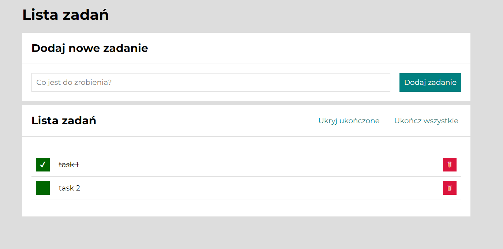

# TO-DO-LIST - Plan the path to your success!
## Demo
https://adam-musial-amu.github.io/to-do-list/
## Description
A simple but useful application for scheduling and executing tasks. It was created as a practical exercise in a [YouCode](https://www.facebook.com/youcodepl) programming course. It was based on pure JS (without advanced libraries), as the purpose of the exercise was to practice ES6+ features such as const, let, and especially arrow functions, as well as CSS (Grid, Flex, BEM).
## Technologies used
- HTML
- CSS
- JavaScript
- BEM
- ES6+ features
- Grid layout
- Flex
- @media queries

## Interface view

